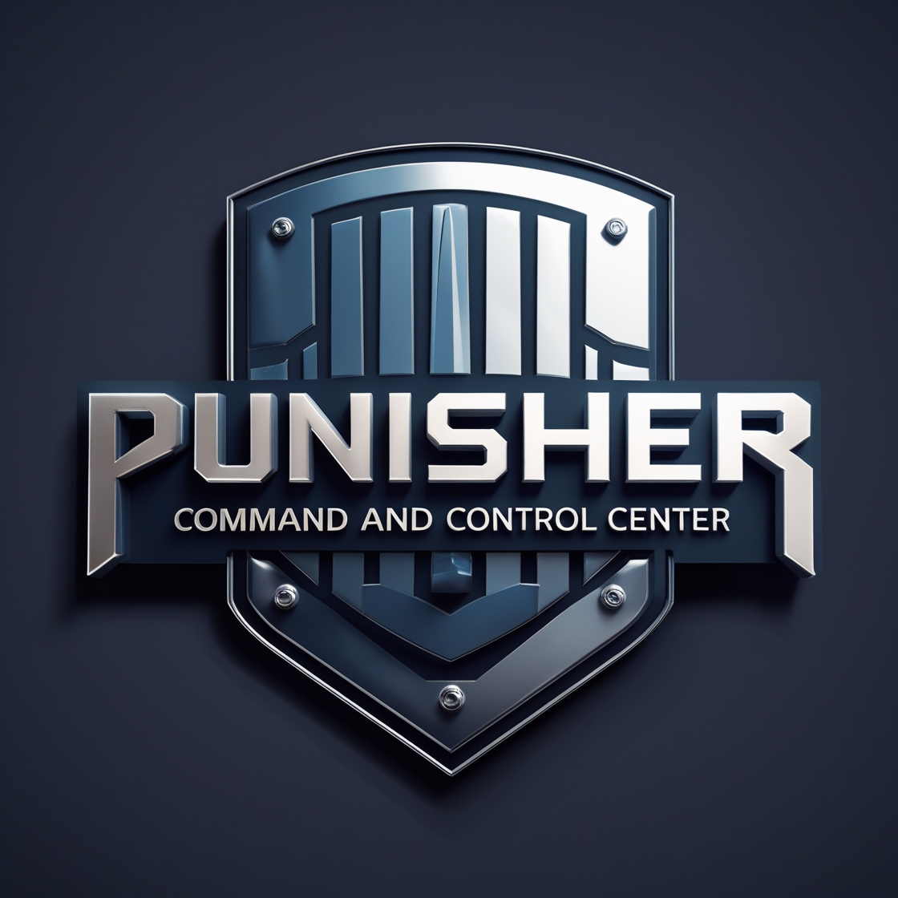

# PunisherC2 Agent



A Rust-based Command and Control (C2) agent designed for system management and remote control capabilities.

## Overview

PunisherC2 Agent is a lightweight and efficient system agent written in Rust that provides remote management capabilities. It features system information gathering, network capabilities, and command execution functionality.

## Features

- System Information Gathering
  - Hardware identification
  - OS information
  - Network interfaces
  - User information
- Command Execution
- Network Communication
- Heartbeat Mechanism
- Secure Registration System

## Dependencies

- os_info: System information retrieval
- whoami: User information
- get_if_addrs: Network interface information
- chrono: Time handling
- winapi: Windows API integration
- reqwest: HTTP client
- serde: Serialization/deserialization
- machine-uid: Hardware-based identification
- uuid: Unique identifier generation

## Building

To build the project, ensure you have Rust installed and run:

```bash
cargo build --release
```

## Usage

The agent runs as a background process and automatically:
1. Registers with the C2 server
2. Sends periodic heartbeats
3. Executes received commands
4. Gathers and reports system information

## Security

- Uses hardware-based identification
- Implements secure communication protocols
- Supports encrypted data transmission

## License

MIT
